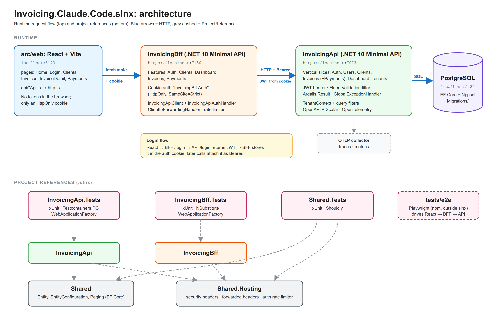

# AGENTS.md
Guidance for AI coding agents working in this repository.

## Project engineering guide
Invoicing REST API. Backend: .NET 10 Minimal API + EF Core (Npgsql).
Frontend: React + Vite.
Keep changes maintainable, tested and consistent with the surrounding code.
New behavior requires a test in `/tests/`. Bug fixes require a regression test.

Add packages via `dotnet add package` or `npm install`. Ask first.

## Repository layout
- `/src/Api` contains dotnet 10 backend webapi.
- `/src/InvoicingBff` contains the dotnet 10 BFF (Backend-For-Frontend) that brokers auth between the React client and the API.
- `/src/Shared` contains dotnet 10 class library general-purpose helpers that have no application-specific behavior.
- `/src/Shared.Hosting` contains ASP.NET Core host setup shared by the API and the BFF (security headers, forwarded headers, auth rate limiter). No EF Core.
- `/tests/Shared.Tests` contains xUnit library.
- `/tests/InvoicingApi.Tests` contains xUnit library.
- `/tests/InvoicingBff.Tests` contains xUnit library.
- `/tests/e2e` contains Playwright E2E tests (standalone npm project).
- `/src/web` contains the React client.

## Commands

Reference `src/docs/commands.md`

## Conventions

### Git & GitHub

Reference `src/docs/github.md`

### API Documentation

Reference `src/docs/api-documentation.md`

### Database

Reference `src/docs/database.md`

- PostgreSQL on localhost:5432.
- Connection string from `ConnectionStrings:Default` in user secrets, never appsettings.json.

### Security

Reference `src/docs/security.md`

### Testing

Reference `src/docs/testing.md`

### Backend

Reference `src/docs/backend.md`

### Frontend

Reference `src/docs/frontend.md`

## Constraints
- Never commit connection strings, API keys, or secrets.
- Never modify files in `/migrations` by hand.
- Ask before adding new NuGet or npm dependencies.
- Run `dotnet build` after backend changes; `npm run build` after frontend changes.
- Run `make format-check` after backend changes. If violations exist, fix them or run `make format` for auto-fixable ones.
