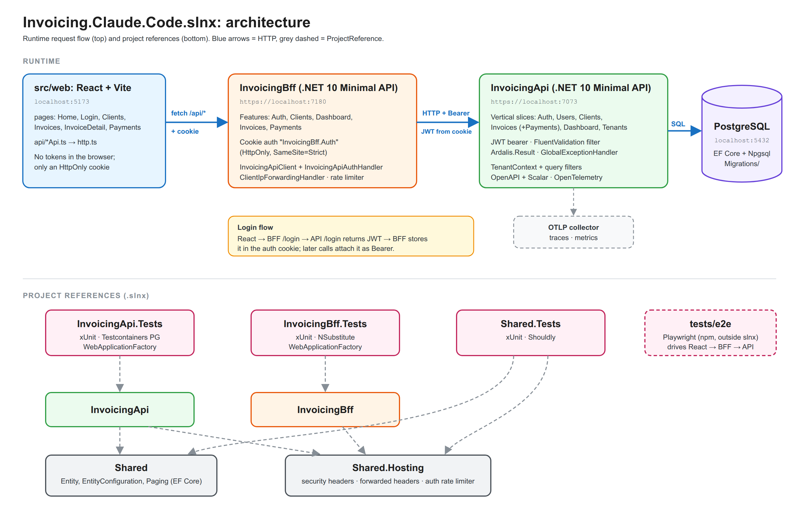

# Architecture

## Overview

Invoicing API built as a Vertical Slice Architecture monolith. Each feature owns its
request, handler, validation, response, and endpoint in a single folder. Cross-cutting
concerns (validation pipeline, telemetry, persistence) are handled at the infrastructure
level, not per-feature.

## Stack

| Concern | Choice |
|---|---|
| Runtime | .NET 10 |
| HTTP | Minimal API |
| Persistence | EF Core + Npgsql |
| Validation | FluentValidation |
| Ardalis.GuardClauses | internal contract checks |
| Ardalis.Result | business outcomes without exceptions|
| Testing (assertions) | Shouldly |
| Testing (mocking) | NSubstitute |
| Observability | OpenTelemetry |
| API docs | Microsoft.AspNetCore.OpenApi + Scalar |

## Vertical Slice Architecture

### Structure
